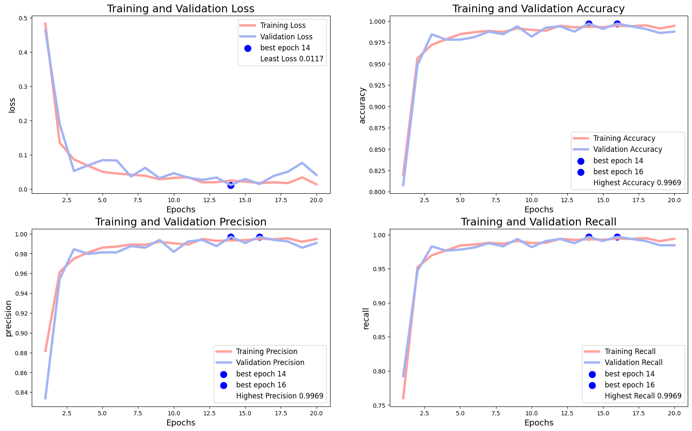
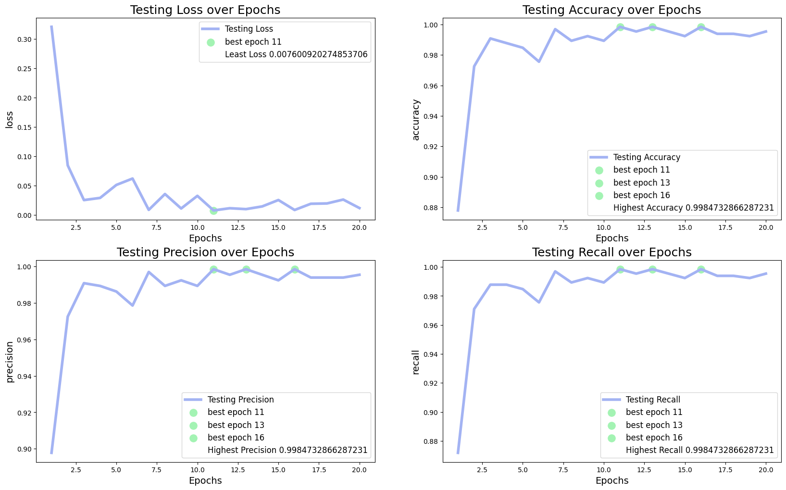
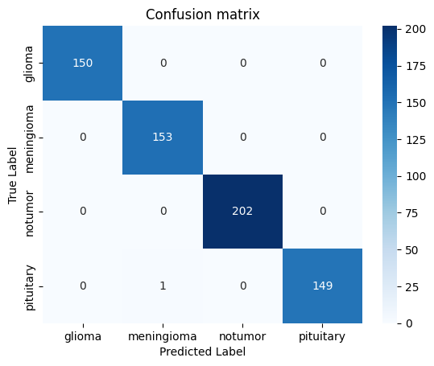
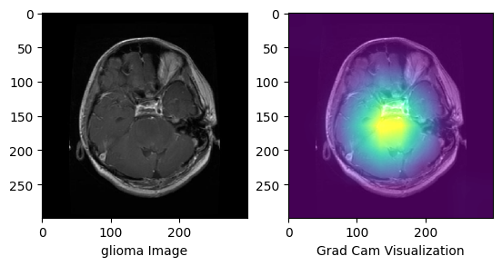
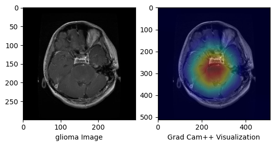

# **Tumor Detection from MRI Scans**

This repository contains a deep learning model and a simple graphical user interface (GUI) for detecting tumors in MRI scans. The project is built using TensorFlow/Keras and leverages transfer learning with the Xception architecture for accurate classification. Grad-CAM and GRAD-CAM++ is supported for visualization.

---

## **Features**

- **Pre-trained Model**: The model is fine-tuned on MRI images for multi-class tumor classification.
- **Image Augmentation**: Improves model generalization through augmented data during training.
- **Training Notebook**: Includes a Jupyter notebook detailing the training process step-by-step.
- **Robust Image Handling**: MRI Scan Images of all Dimensions and Mode are accepted as they are handled Dynamically.
- **Visualization**: Grad-CAM and GRAD-CAM++ methods are used to visualize part of the image that model focused on.
- **Utilities**: functions required to predict, classify, and to get confidence are provided in util.py. Grad CAM and GRAD-CAM++ functions are available in GradCam.py
- **GUI Interface for Testing**: A Custom tkinter GUI is provided to test the model and visualization.

---

## **Installation**

1. Clone the repository:
   ```bash
   git clone https://github.com/aurogenic/Brain-Tumor-Detector-From-MRI-Scan
   cd Brain-Tumor-Detector-From-MRI-Scan
   ```
2. Install dependencies:
   ```bash
   pip install -r requirements.txt
   ```
3. Run the GUI:
   ```bash
   python app.py
   ```

---

## **Repository Contents**
```

```
---

## **Usage**

- Open the GUI and upload an MRI image for classification.
- The application will display the predicted tumor type along with the confidence score.

---


## **Hugging Face Models**
The trained models are available on Hugging Face for easy access and inference:

- Model from epoch 11 (Best Loss): Hugging Face Link

- Model from epoch 13 (Best External Dataset Performance): Hugging Face Link

- Model from epoch 16 (Best Validation Performance): Hugging Face Link 


# **Using the Models via API**

Hugging Face provides an easy-to-use API to load the model directly into Python:
```
from transformers import AutoModel
import tensorflow as tf
from util import classify

# Load the model
model = tf.keras.models.load_model("aurogenic/Brain-Tumor-Detection")

img_path = "Path/to/image"
print(f"CLass: {classify(img_path, model)}")
```

## **Methodology**

1. **Dataset**:

- 7023 MRI Scans of Brain Tumor and No tumor Images are collected from [Kaggle](https://www.kaggle.com/datasets/masoudnickparvar/brain-tumor-mri-dataset)
- The Dataset is categoried into 4 classes
  - No Tumor
  - Glioma
  - Meningioma
  - Pituitary

  
- Disrtibution is as follows:
  
  

2. **PreProcessing**:

- Data Augumentation is necessary to avoid overfitting. So Image Data Generator from keras library is used to Augument the Images by randomly applying following transformations

  - rescale
  - rotation
  - width shift
  - height shift
  - shear
  - zoom
  - horizontal flip
  - fill nearest
  - brightness

  ```
  train_datagen = ImageDataGenerator(
      rescale=1./255,
      rotation_range=30,
      width_shift_range=0.2,
      height_shift_range=0.2,
      shear_range=0.2,
      zoom_range=0.2,
      horizontal_flip=True,
      fill_mode='nearest', brightness_range=(0.8, 1.2)
  )
  ```

3. **Training**:

- Xception Architecture is used as base with imagenet weights.
- Further layers (Flatten, Dropout, Dense, Dropout and Dense) are added.
- This architecture is inspired from [Here](https://www.kaggle.com/code/yousefmohamed20/brain-tumor-mri-accuracy-99).
- But following modifications where carried out to minimize overfitting and support Grad Cam visualization.
  - Instead of using Xception Architecture as a base Layer along with other layer, in this approach other layrers are added to inner layers of Xception architecture this allows to visualize inner layers of Xception with Grad CAM and also improves training.
  - softmax activation in the Xceptions last layer is removed so that Grad Cam visualization can done in follwing layers.
  - 0.0001 learning rate was choosen to reduce overfitting.

```
    img_shape =(299, 299, 3)

    base_model = Xception(
        include_top = False,
        weights = "imagenet",
        input_shape = img_shape,
        pooling='max'
    )

    base_model.layers[-1].activation = None

    x = base_model.output
    x = Flatten()(x)
    x = Dropout(0.3)(x)
    x = Dense(128, activation='relu')(x)
    x = Dropout(0.25)(x)
    output = Dense(4, activation='softmax')(x)
    model = Model(inputs=base_model.input, outputs=output)

    model.compile(
        optimizer=Adam(learning_rate=0.0001),
        loss='categorical_crossentropy',
        metrics=['accuracy', Precision(), Recall()]
    )
```

- The model was trained for 20 epochs with 50% of testing data for validation.
- Model was saved in each epoch using checkpoints.

```
checkpoint = ModelCheckpoint(
    filepath = "Models/Xception/wave_2/model_epoch_{epoch:02}.keras",
    save_weights_only = False,
    save_best_only = False,
    monitor = 'val_loss',
    mode = 'min',
    verbose = 0
)

history = model.fit(
    train_generator,
    steps_per_epoch=train_generator.samples // train_generator.batch_size,
    validation_data=val_generator,
    validation_steps=val_generator.samples // val_generator.batch_size,
    epochs=20, batch_size=16,
    callbacks = [checkpoint]
)
```

- The following validation results were obtained.



4. **Comparing models from each epoch**:

   - Other 50% of the validation data with Augumentation was used to test models of each epoch for comparision.
   - Results were outstanding!!.
   - Epoch 11, 13 and 16 models got:
     - Accuracy : 0.99847
     - Precision : 0.99847
     - Recall : 0.99847
   - while epoch 11 model got the least loss.
     - loss: 0.0076

   

5. **Evaluating the Model**:

- Model from epoch 16 was choosen for evaluation instead of epoch 11 by considering both testing and validation results.
- Following classification report was obtained.

  ```
                    precision    recall  f1-score   support

      glioma         0.993377  1.000000  0.996678       150
      meningioma     1.000000  1.000000  1.000000       153
      notumor        1.000000  1.000000  1.000000       202
      pituitary      1.000000  0.993333  0.996656       150

      accuracy                           0.998473       655
      macro avg      0.998344  0.998333  0.998333       655
      weighted avg   0.998483  0.998473  0.998473       655
  ```

- Further Calculations yeilded

  ```
  Matthews Correlation Coeficient: 0.9980
  ```

- Following ROC curve and AUC were obsered

  

- The Confusion Matrix shows that only one prediction was wrong.

  

5. **Testing with External Dataset**:

- Models from epoch 11, 13 and 16 were tested with larger External Dataset from [kaggle](https://www.kaggle.com/datasets/lakshancooray23/tumour-classification-images)
- This dataset contains 49704 Images sofficient enought for testing.
- Model from epoch 13 performed very well with this data and got 0.9950 accuracy while epoch 11 and 16 models got 0.9792 and 0.9872 respectively.
- Model 13s performance is as follows.

```
                precision    recall  f1-score   support

    glioma         0.9963    0.9959    0.9961     13990
    meningioma     0.9916    0.9956    0.9936     11870
    notumor        0.9926    0.9983    0.9954     11786
    pituitary      0.9992    0.9900    0.9946     12058

    accuracy                           0.9950     49704
   macro avg       0.9949    0.9950    0.9949     49704
weighted avg       0.9950    0.9950    0.9950     49704

Matthews Correlation Coefficient: 0.9933
```


6. **Grad CAM and Grad CAM++**:
Gradient-Weighted Class Activation Mapping is a technique in computer vision and deep learning that helps users understand how convolutional neural networks (CNNs) make predictions.
It allows us to see what parts of the image a layer focuses on order to make predictions. Grad CAM++ improves this further by back propogation. This are visualized by masking the heatmap over the image.






## **Contributing**

Feel free to contribute by submitting issues or pull requests. Let's improve this project together!
